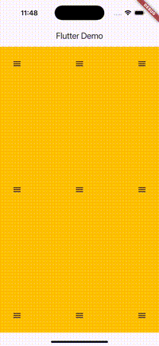

Highly and easily customizable fan menu in Stack widget, you can place components anywhere in the screen.

## Features

- Based on the Stack layout, the system supports the top, middle, bottom, and left, middle, and right positions
- Stack can be placed anywhere in the page content area
- Support RTL display mode

## Screenshots



## Getting started

- Terminal command

``` bash
flutter pub add pp_fan_menu
```

- Display recommend
  
| Direction position | Best display quantity |
| :----  | :---- |
| topStart | 2-4 |
| centerStart | 1-6 |
| bottomStart | 2-4 |
| topCenter | 1-6 |
| center | 1-12 |
| bottomCenter | 1-6 |
| topEnd | 2-4 |
| centerEnd | 1-6 |
| bottomEnd | 2-4 |

- Custom layout & set angles

If you want to customize the Angle control of the number, add `startAngle` and `singleAngle` parameters to control it.

``` dart
 Positioned.fill(
  child: PPFanMenu(
    alignment: AlignmentDirectional.bottomEnd,
    radius: 100,
    startAngle: 145,
    singleAngle: 32,
    openIcon: const Icon(Icons.menu),
    hideIcon: const Icon(Icons.close),
    onChildPressed: (index) {
      print('Child $index pressed');
    },
    onExpandChanged: (isOpen) {
      print('Menu is ${isOpen ? 'open' : 'closed'}');
    },
    children: const [
      Icon(Icons.star, size: 40),
      Icon(Icons.camera, size: 40),
      Icon(Icons.mail, size: 40),
      Icon(Icons.call, size: 40),
    ],
  ),
),
```

## Usage

```dart
class FanMenuExample extends StatelessWidget {
  FanMenuExample({super.key});

  final GlobalKey<PPFanMenuState> _fanMenuKey = GlobalKey<PPFanMenuState>();

  @override
  Widget build(BuildContext context) {
    return Scaffold(
      appBar: AppBar(
        title: Text(S.current.appTitle),
      ),
      body: SafeArea(
        child: Container(
          color: Colors.amber,
          // width: 300,
          // height: 300,
          padding: const EdgeInsets.symmetric(vertical: 15, horizontal: 15),
          child: Stack(
            children: [
              // Start
              Positioned.fill(
                child: PPFanMenu(
                  alignment: AlignmentDirectional.topStart, //左上角建议：2-4个选项最佳
                  openIcon: const Icon(Icons.menu),
                  hideIcon: const Icon(Icons.close),
                  onChildPressed: (index) {
                    print('Child $index pressed');
                  },
                  children: const [
                    Icon(Icons.star, size: 40),
                    Icon(Icons.camera, size: 40),
                    Icon(Icons.mail, size: 40),
                    Icon(Icons.call, size: 40),
                  ],
                ),
              ),
              Positioned.fill(
                child: PPFanMenu(
                  alignment: AlignmentDirectional.centerStart, //左中建议：1-6个选项最佳
                  openIcon: const Icon(Icons.menu),
                  hideIcon: const Icon(Icons.close),
                  onChildPressed: (index) {
                    print('Child $index pressed');
                  },
                  children: const [
                    Icon(Icons.star, size: 40),
                    Icon(Icons.camera, size: 40),
                    Icon(Icons.mail, size: 40),
                    Icon(Icons.call, size: 40),
                    Icon(Icons.message, size: 40),
                    Icon(Icons.favorite, size: 40),
                  ],
                ),
              ),
              Positioned.fill(
                child: PPFanMenu(
                  alignment: AlignmentDirectional.bottomStart, //左下角建议：2-4个选项最佳
                  openIcon: const Icon(Icons.menu),
                  hideIcon: const Icon(Icons.close),
                  onChildPressed: (index) {
                    print('Child $index pressed');
                  },
                  children: const [
                    Icon(Icons.star, size: 40),
                    Icon(Icons.camera, size: 40),
                    Icon(Icons.mail, size: 40),
                    Icon(Icons.call, size: 40),
                  ],
                ),
              ),
              // Center
              Positioned.fill(
                child: PPFanMenu(
                  alignment: AlignmentDirectional.topCenter, //上中建议：1-6个选项最佳
                  openIcon: const Icon(Icons.menu),
                  hideIcon: const Icon(Icons.close),
                  onChildPressed: (index) {
                    print('Child $index pressed');
                  },
                  children: const [
                    Icon(Icons.star, size: 40),
                    Icon(Icons.camera, size: 40),
                    Icon(Icons.mail, size: 40),
                    Icon(Icons.call, size: 40),
                    Icon(Icons.message, size: 40),
                    Icon(Icons.favorite, size: 40),
                  ],
                ),
              ),
              Positioned.fill(
                child: PPFanMenu(
                  alignment: AlignmentDirectional.center, //中心建议：1-12个选项最佳
                  openIcon: const Icon(Icons.menu),
                  hideIcon: const Icon(Icons.close),
                  onChildPressed: (index) {
                    print('Child $index pressed');
                  },
                  children: const [
                    Icon(Icons.star, size: 40),
                    Icon(Icons.camera, size: 40),
                    Icon(Icons.mail, size: 40),
                    Icon(Icons.commute, size: 40),
                    Icon(Icons.face, size: 40),
                    Icon(Icons.message, size: 40),
                    // Icon(Icons.message, size: 40),
                    // Icon(Icons.message, size: 40),
                    // Icon(Icons.message, size: 40),
                    // Icon(Icons.message, size: 40),
                    // Icon(Icons.message, size: 40),
                    // Icon(Icons.message, size: 40),
                  ],
                ),
              ),
              Positioned.fill(
                child: PPFanMenu(
                  alignment: AlignmentDirectional.bottomCenter, //下中建议：1-6个选项最佳
                  openIcon: const Icon(Icons.menu),
                  hideIcon: const Icon(Icons.close),
                  onChildPressed: (index) {
                    print('Child $index pressed');
                  },
                  children: const [
                    Icon(Icons.star, size: 40),
                    Icon(Icons.camera, size: 40),
                    Icon(Icons.mail, size: 40),
                    Icon(Icons.call, size: 40),
                    Icon(Icons.message, size: 40),
                    Icon(Icons.favorite, size: 40),
                  ],
                ),
              ),
              // End
              Positioned.fill(
                child: PPFanMenu(
                  key: _fanMenuKey,
                  alignment: AlignmentDirectional.topEnd, //右上角建议：2-4个选项最佳
                  openIcon: const Icon(Icons.menu),
                  hideIcon: const Icon(Icons.close),
                  onChildPressed: (index) {
                    print('Child $index pressed');
                  },
                  children: const [
                    Icon(Icons.star, size: 40),
                    Icon(Icons.camera, size: 40),
                    Icon(Icons.mail, size: 40),
                    Icon(Icons.call, size: 40),
                  ],
                ),
              ),
              Positioned.fill(
                child: PPFanMenu(
                  alignment: AlignmentDirectional.centerEnd, //右中建议：1-6个选项最佳
                  openIcon: const Icon(Icons.menu),
                  hideIcon: const Icon(Icons.close),
                  onChildPressed: (index) {
                    print('Child $index pressed');
                  },
                  children: const [
                    Icon(Icons.star, size: 40),
                    Icon(Icons.camera, size: 40),
                    Icon(Icons.mail, size: 40),
                    Icon(Icons.call, size: 40),
                    Icon(Icons.message, size: 40),
                    Icon(Icons.favorite, size: 40),
                  ],
                ),
              ),
              Positioned.fill(
                child: PPFanMenu(
                  alignment: AlignmentDirectional.bottomEnd, //右下角建议：2-4个选项最佳
                  radius: 100,
                  // startAngle: 145,
                  // singleAngle: 32,
                  openIcon: const Icon(Icons.menu),
                  hideIcon: const Icon(Icons.close),
                  onChildPressed: (index) {
                    print('Child $index pressed');
                  },
                  onExpandChanged: (isOpen) {
                    print('Menu is ${isOpen ? 'open' : 'closed'}');
                  },
                  children: const [
                    Icon(Icons.star, size: 40),
                    Icon(Icons.camera, size: 40),
                    Icon(Icons.mail, size: 40),
                    Icon(Icons.call, size: 40),
                  ],
                ),
              ),
            ],
          ),
        ),
      ),
    );
  }
}
```
