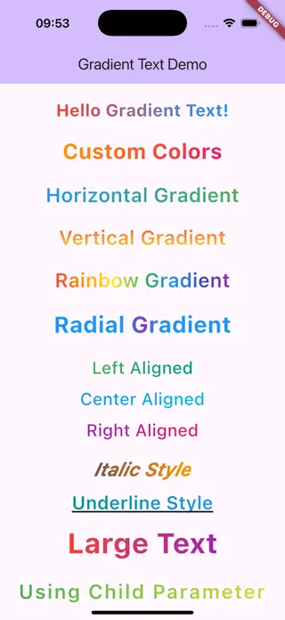

<!--
This README describes the package. If you publish this package to pub.dev,
this README's contents appear on the landing page for your package.

For information about how to write a good package README, see the guide for
[writing package pages](https://dart.dev/tools/pub/writing-package-pages).

For general information about developing packages, see the Dart guide for
[creating packages](https://dart.dev/guides/libraries/create-packages)
and the Flutter guide for
[developing packages and plugins](https://flutter.dev/to/develop-packages).
-->

# PP Gradient Text

A simple and easy-to-use custom text gradient component for Flutter.

## Features

- 🎨 **Easy to use**: Simple API with sensible defaults
- 🎭 **Customizable**: Support for any gradient type (Linear, Radial, Sweep)
- 📝 **Flexible**: Can be used with custom Text widgets via child parameter
- 🎯 **Complete control**: Full control over text style, alignment, and gradient properties
- 💪 **Compatible**: Works with all Flutter platforms

## Screenshots



## Getting started

### Installation

Add this to your package's `pubspec.yaml` file:

```yaml
dependencies:
  pp_gradient_text: ^1.0.0
```

Then run:

```bash
flutter pub get
```

### Import

Import the package in your Dart code:

```dart
import 'package:pp_gradient_text/pp_gradient_text.dart';
```

## Usage

### Basic Usage

```dart
GradientText(
  text: 'Hello Gradient Text!',
)
```

### Custom Colors

```dart
GradientText(
  text: 'Custom Colors',
  gradient: const LinearGradient(
    colors: [Colors.orange, Colors.pink],
    begin: Alignment.topLeft,
    end: Alignment.bottomRight,
  ),
  textStyle: const TextStyle(fontSize: 30, fontWeight: FontWeight.bold),
)
```

### Horizontal Gradient

```dart
GradientText(
  text: 'Horizontal Gradient',
  gradient: const LinearGradient(
    colors: [Colors.blue, Colors.green],
    begin: Alignment.centerLeft,
    end: Alignment.centerRight,
  ),
  textStyle: const TextStyle(fontSize: 28, fontWeight: FontWeight.w600),
)
```

### Vertical Gradient

```dart
GradientText(
  text: 'Vertical Gradient',
  gradient: const LinearGradient(
    colors: [Colors.red, Colors.yellow],
    begin: Alignment.topCenter,
    end: Alignment.bottomCenter,
  ),
  textStyle: const TextStyle(fontSize: 28, fontWeight: FontWeight.w600),
)
```

### Rainbow Gradient

```dart
GradientText(
  text: 'Rainbow Gradient',
  gradient: const LinearGradient(
    colors: [
      Colors.red,
      Colors.orange,
      Colors.yellow,
      Colors.green,
      Colors.blue,
      Colors.indigo,
      Colors.purple,
    ],
    begin: Alignment.centerLeft,
    end: Alignment.centerRight,
  ),
  textStyle: const TextStyle(fontSize: 28, fontWeight: FontWeight.w600),
)
```

### Radial Gradient

```dart
GradientText(
  text: 'Radial Gradient',
  gradient: const RadialGradient(
    colors: [Colors.purple, Colors.blue],
    center: Alignment.center,
    radius: 0.5,
  ),
  textStyle: const TextStyle(fontSize: 32, fontWeight: FontWeight.bold),
)
```

### Using Child Parameter

```dart
GradientText(
  text: 'This won\'t be shown',
  gradient: const LinearGradient(
    colors: [Colors.green, Colors.lime],
  ),
  child: const Text(
    'Using Child Parameter',
    style: TextStyle(
      fontSize: 28,
      fontWeight: FontWeight.w600,
      letterSpacing: 2,
    ),
  ),
)
```

### In Container

```dart
Container(
  padding: const EdgeInsets.all(16),
  decoration: BoxDecoration(
    color: Colors.black,
    borderRadius: BorderRadius.circular(12),
  ),
  child: GradientText(
    text: 'In Black Container',
    gradient: const LinearGradient(
      colors: [Colors.white, Colors.grey],
    ),
    textStyle: const TextStyle(fontSize: 24, fontWeight: FontWeight.bold),
  ),
)
```

## API Reference

### GradientText

| Parameter | Type | Description | Required | Default |
|-----------|------|-------------|----------|---------|
| `text` | `String` | The text to display | ✅ | - |
| `gradient` | `Gradient` | The gradient to apply to the text | ❌ | `LinearGradient(colors: [Colors.red, Colors.blue])` |
| `textStyle` | `TextStyle` | The text style | ❌ | `TextStyle(fontSize: 24, fontWeight: FontWeight.bold)` |
| `textAlign` | `TextAlign` | The text alignment | ❌ | `TextAlign.center` |
| `child` | `Text?` | Custom Text widget (overrides text parameter) | ❌ | `null` |

## Example App

Check out the [example](example/lib/main.dart) directory for a complete example app demonstrating all the features of this package.

To run the example:

```bash
cd example
flutter run
```

## Additional information

### Contributing

Contributions are welcome! Please feel free to submit a Pull Request.

### Issues

If you encounter any issues, please file an issue on the [GitHub repository](https://github.com/yourusername/pp_flutter_kits/issues).

### License

This package is licensed under the MIT License. See the [LICENSE](LICENSE) file for more information.
