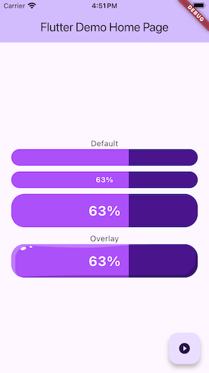

Easy and highly customizable style progress bar

## Functional features

- Customize height, progress value, rounded corners
- Custom display percentage values, text style
- Default track color, highlighted track color, and highlighted track fillet
- Transparent overlay can be added to enhance the display effect

## Example effect



## Usage

```dart
Padding(
    padding: EdgeInsets.symmetric(horizontal: 20.px),
    child: PPProgressBar(
        value: progress.toDouble() / 100.0,
        height: 60.px,
        borderRadius: 24.px,
        trackColor: HexColor('#4A148C'),
        progressColor: HexColor('#AC50F9'),
        progressRadius: 1.0,
        percentageStyle: TextStyle(
            color: Colors.white,
            fontSize: 24.px,
            fontWeight: FontWeight.bold,
        ),
        overlay: Image.asset(
            A.imageButtonHighlight,
            fit: BoxFit.fill,
        ),
    ),
)
```
