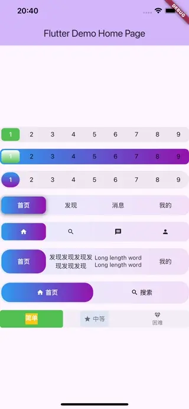

A simple and easy-to-use, highly customizable Segmented Control component.

## Features

- Supports fixed width, rounded corners, shadows, content adaptive scaling, and image-text combination.
- Supports custom background color: solid color, gradient color.
- Supports custom indicator background: solid color, gradient color, image, etc. (custom widgets).
- Supports scrolling mode: (under development)

## Screenshots


[Video](screenshots/video.mp4)

## Getting started

```yaml
dependencies:
  pp_segmented: ^1.0.1
```

## Usage

简单示例：

```dart
 // Text Mode
PPSegmentedControl<int>(
    items: [
        SegmentItem(value: 1, child: Text('Home')),
        SegmentItem(value: 2, child: Text('Find')),
        SegmentItem(value: 3, child: Text('Message')),
        SegmentItem(value: 4, child: Text('Me')),
    ],
    selectedValue: 1,
    onChanged: (value) => print('选中: $value'),
    height: 45,
    borderRadius: 12,
    backgroundGradient: LinearGradient(
    colors: [
        Colors.blue.withOpacity(0.1),
        Colors.purple.withOpacity(0.1),
    ],
    ),
    indicatorGradient:
        LinearGradient(colors: [Colors.blue, Colors.purple]),
    indicatorBorderRadius: 10,
    indicatorShadow: [
    BoxShadow(
        color: Colors.black.withOpacity(0.5),
        blurRadius: 8,
        offset: Offset(0, 2),
    ),
    ],
    selectedTextColor: Colors.white,
    unselectedTextColor: Colors.black87,
),
SizedBox(height: 15),
// Icon Mode
PPSegmentedControl<int>(
    items: [
        SegmentItem(value: 1, child: Icon(Icons.home, size: 16)),
        SegmentItem(value: 2, child: Icon(Icons.search, size: 16)),
        SegmentItem(value: 3, child: Icon(Icons.message, size: 16)),
        SegmentItem(value: 4, child: Icon(Icons.person, size: 16)),
    ],
    selectedValue: 1,
    onChanged: (value) => print('选中: $value'),
    height: 45,
    borderRadius: 12,
    backgroundGradient: LinearGradient(
    colors: [
        Colors.blue.withOpacity(0.1),
        Colors.purple.withOpacity(0.1),
    ],
    ),
    indicatorGradient:
        LinearGradient(colors: [Colors.blue, Colors.purple]),
    indicatorBorderRadius: 10,
    selectedTextColor: Colors.white,
    unselectedTextColor: Colors.black87,
),
SizedBox(height: 15),
```

## Additional information

View more examples of code and `example`
