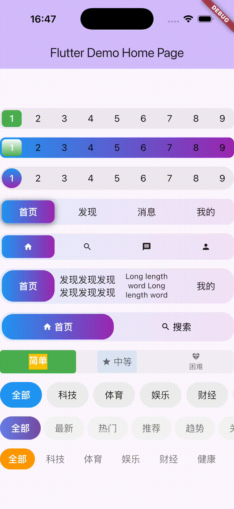

一个简单易用，高度自定义的Segmented Control组件

## Features

- 支持固定宽度，圆角，阴影，内容自适应缩放，图文组合
- 支持自定义背景色：纯色、渐变色
- 支持自定义指示器背景：纯色、渐变色、图片、等自定义widget
- 支持滚动模式
- 支持自定义方向：水平模式，垂直模式（即将到来）

## Screenshots


也可以观看视频：[视频](screenshots/output.mp4)

## Getting started

```yaml
dependencies:
  pp_segmented: ^1.0.3
```

## Usage

简单示例：

```dart
 // 文字模式
PPSegmentedControl<int>(
    items: [
        SegmentItem(value: 1, child: Text('首页')),
        SegmentItem(value: 2, child: Text('发现')),
        SegmentItem(value: 3, child: Text('消息')),
        SegmentItem(value: 4, child: Text('我的')),
    ],
    selectedValue: 1,
    onChanged: (value) => print('选中: $value'),
    height: 45,
    borderRadius: 12,
    backgroundGradient: LinearGradient(
    colors: [
        Colors.blue.withOpacity(0.1),
        Colors.purple.withOpacity(0.1),
    ],
    ),
    indicatorGradient:
        LinearGradient(colors: [Colors.blue, Colors.purple]),
    indicatorBorderRadius: 10,
    indicatorShadow: [
    BoxShadow(
        color: Colors.black.withOpacity(0.5),
        blurRadius: 8,
        offset: Offset(0, 2),
    ),
    ],
    selectedTextColor: Colors.white,
    unselectedTextColor: Colors.black87,
),
SizedBox(height: 15),
// 图标模式
PPSegmentedControl<int>(
    items: [
        SegmentItem(value: 1, child: Icon(Icons.home, size: 16)),
        SegmentItem(value: 2, child: Icon(Icons.search, size: 16)),
        SegmentItem(value: 3, child: Icon(Icons.message, size: 16)),
        SegmentItem(value: 4, child: Icon(Icons.person, size: 16)),
    ],
    selectedValue: 1,
    onChanged: (value) => print('选中: $value'),
    height: 45,
    borderRadius: 12,
    backgroundGradient: LinearGradient(
    colors: [
        Colors.blue.withOpacity(0.1),
        Colors.purple.withOpacity(0.1),
    ],
    ),
    indicatorGradient:
        LinearGradient(colors: [Colors.blue, Colors.purple]),
    indicatorBorderRadius: 10,
    selectedTextColor: Colors.white,
    unselectedTextColor: Colors.black87,
),
SizedBox(height: 15),
```

## Additional information

更多示例查看代码和 `example`

```dart
Column(
    mainAxisAlignment: MainAxisAlignment.center,
    crossAxisAlignment: CrossAxisAlignment.start,
    children: <Widget>[
    // 数字模式示例1- 纯色
    numberModeSample1(),
    SizedBox(height: 15),
    // 数字模式示例2- 渐变
    numberModeSample2(),
    SizedBox(height: 15),
    // 数字模式示例3- 圆角
    numberModelSample3(),
    SizedBox(height: 15),
    // 文字模式
    textModeSample1(),
    SizedBox(height: 15),
    // 图标模式
    iconModeSample1(),
    SizedBox(height: 15),
    // 文字自适应
    textAutoSizeSample(),
    SizedBox(height: 15),
    // 图文组合
    iconTextSample(),
    SizedBox(height: 15),
    // 自定义复杂内容
    customMoreSample(),
    SizedBox(height: 15),
    // 滚动模式 - 自定义Item样式（背景、圆角、间距）
    scrollModeSample1(),
    SizedBox(height: 15),
    // 滚动模式 - 渐变背景
    scrollModeSample2(),
    SizedBox(height: 15),
    // 滚动模式 - 简单样式（透明背景）
    scrollModeSample3(),
    ],
)
```
